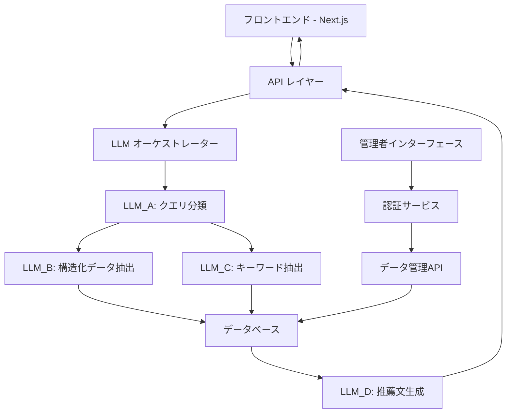

# 設計ドキュメント

## 概要

このドキュメントでは、自然言語によるレストラン検索アプリケーションの技術設計について詳細に説明します。このアプリケーションは、ユーザーが自然言語で質問を入力すると、複数のLLM（大規模言語モデル）を使用して質問を分析し、適切なレストランを推薦するシステムです。

## アーキテクチャ

システムは以下の主要コンポーネントで構成されます：

### 全体アーキテクチャ



### 技術スタック

1. **フロントエンド**:
   - Next.js 14
   - React 18
   - Tailwind CSS
   - AWS Amplify UI コンポーネント

2. **バックエンド**:
   - AWS Amplify Gen2
   - AWS Lambda 関数（LLM処理用）
   - Amazon Bedrock（LLMサービス）
   - Amazon DynamoDB（データストレージ）

3. **認証**:
   - AWS Cognito（Amplify Auth）

4. **デプロイ**:
   - AWS Amplify Hosting
   - AWS CDK

## コンポーネントとインターフェース

### 1. フロントエンドコンポーネント

#### 1.1 検索インターフェース
- シンプルで中央に配置された検索ボックス
- 検索処理中のローディングインジケーター
- LLM処理の思考プロセス表示（オプション）

#### 1.2 結果表示コンポーネント
- 推薦テキスト表示エリア
- レストランカードグリッド
  - 各カードには名前、場所、料理タイプ、評価などの基本情報
  - クリックで詳細情報を表示

#### 1.3 管理者インターフェース
- ログイン/認証フォーム
- レストランデータ管理ダッシュボード
- データ統計と分析ビュー

### 2. バックエンドサービス

#### 2.1 API レイヤー
- REST APIエンドポイント：
  - `/api/search` - 自然言語検索クエリを処理
  - `/api/restaurants` - レストラン情報のCRUD操作
  - `/api/admin` - 管理機能

#### 2.2 LLMオーケストレーター
- 複数のLLMを調整して検索処理を実行
- 各LLMの入出力を管理
- 結果の集約と最終レスポンスの生成

#### 2.3 認証サービス
- ユーザー登録とログイン
- 管理者権限の管理
- セッション管理

## データモデル

### 1. レストランモデル

```typescript
type Restaurant = {
  id: string;              // ユニークID
  name: string;            // レストラン名
  description: string;     // 説明
  location: {              // 位置情報
    address: string;       // 住所
    area: string;          // エリア（渋谷、新宿など）
    coordinates: {         // 座標
      latitude: number;
      longitude: number;
    }
  };
  cuisine: string[];       // 料理タイプ（和食、イタリアン、居酒屋など）
  priceRange: {            // 価格帯
    min: number;
    max: number;
    category: "¥" | "¥¥" | "¥¥¥" | "¥¥¥¥";  // 価格カテゴリ
  };
  openingHours: {          // 営業時間
    [day: string]: {       // 曜日ごとの営業時間
      open: string;        // 開店時間（HH:MM形式）
      close: string;       // 閉店時間（HH:MM形式）
    }
  };
  features: string[];      // 特徴（個室あり、禁煙、ペット可など）
  ambience: string[];      // 雰囲気（カジュアル、フォーマル、デートにぴったりなど）
  ratings: {               // 評価
    average: number;       // 平均評価（5段階）
    count: number;         // 評価数
  };
  images: string[];        // 画像URL
  keywords: string[];      // 検索キーワード
  createdAt: string;       // 作成日時
  updatedAt: string;       // 更新日時
};
```

### 2. ユーザーモデル

```typescript
type User = {
  id: string;              // ユニークID
  email: string;           // メールアドレス
  name?: string;           // 名前（オプション）
  role: "user" | "admin";  // ユーザーロール
  createdAt: string;       // 作成日時
  updatedAt: string;       // 更新日時
};
```

### 3. 検索クエリモデル

```typescript
type SearchQuery = {
  id: string;              // ユニークID
  rawQuery: string;        // 元のクエリテキスト
  structuredData: {        // 抽出された構造化データ
    location?: string;     // 場所
    cuisine?: string[];    // 料理タイプ
    priceRange?: {         // 価格帯
      min?: number;
      max?: number;
      category?: string;
    };
    openingHours?: {       // 営業時間
      day?: string;
      time?: string;
    };
    features?: string[];   // 特徴
  };
  keywords: string[];      // 抽出されたキーワード
  userId?: string;         // ユーザーID（ログイン時）
  timestamp: string;       // タイムスタンプ
};
```

### 4. 検索結果モデル

```typescript
type SearchResult = {
  message: string;         // 推薦テキスト
  restaurants: string[];   // レストランIDのリスト
};
```

## Amplify データスキーマ

```typescript
import { type ClientSchema, a, defineData } from "@aws-amplify/backend";

const schema = a.schema({
  Restaurant: a
    .model({
      name: a.string().required(),
      description: a.string(),
      address: a.string().required(),
      area: a.string().required(),
      latitude: a.float(),
      longitude: a.float(),
      cuisine: a.string().array(),
      priceMin: a.integer(),
      priceMax: a.integer(),
      priceCategory: a.string(),
      openingHours: a.json(),
      features: a.string().array(),
      ambience: a.string().array(),
      ratingAverage: a.float(),
      ratingCount: a.integer(),
      images: a.string().array(),
      keywords: a.string().array(),
    })
    .authorization((allow) => [
      allow.public().to(["read"]),
      allow.userPool("admin").to(["create", "read", "update", "delete"]),
    ]),

  User: a
    .model({
      email: a.string().required(),
      name: a.string(),
      role: a.string().required(),
    })
    .authorization((allow) => [
      allow.owner().to(["read", "update"]),
      allow.userPool("admin").to(["create", "read", "update", "delete"]),
    ]),

  SearchQuery: a
    .model({
      rawQuery: a.string().required(),
      structuredData: a.json(),
      keywords: a.string().array(),
      userId: a.string(),
    })
    .authorization((allow) => [
      allow.public().to(["create"]),
      allow.owner().to(["read"]),
      allow.userPool("admin").to(["read", "delete"]),
    ]),
});

export type Schema = ClientSchema<typeof schema>;

export const data = defineData({
  schema,
  authorizationModes: {
    defaultAuthorizationMode: "userPool",
    apiKeyAuthorizationMode: {
      expiresInDays: 30,
    },
  },
});
```

## エラー処理

### 1. フロントエンドエラー処理
- ユーザー入力バリデーション
- API通信エラーの処理とリトライ
- ユーザーフレンドリーなエラーメッセージ表示

### 2. バックエンドエラー処理
- 入力検証と適切なHTTPステータスコードの返却
- LLM処理エラーのハンドリング
- データベースエラーの処理とロギング
- エラーログの集約と監視

### 3. LLMエラー処理
- LLMレスポンスの検証
- タイムアウト処理
- フォールバックメカニズム（一つのLLMが失敗した場合の代替処理）

## テスト戦略

### 1. ユニットテスト
- フロントエンドコンポーネントのテスト
- バックエンドサービスの関数テスト
- データモデルのバリデーションテスト

### 2. 統合テスト
- API エンドポイントのテスト
- LLMオーケストレーションのテスト
- データベース操作のテスト

### 3. E2Eテスト
- ユーザーフローのテスト
- 検索から結果表示までの一連の流れのテスト
- 管理者機能のテスト

### 4. LLM特有のテスト
- 様々な自然言語クエリに対するレスポンスのテスト
- エッジケースと異常系のテスト
- パフォーマンステスト（レスポンス時間など）

## LLM実装詳細

### LLM_A: クエリ分類
- **入力**: ユーザーの自然言語クエリ
- **出力**: 構造化データとキーワードの分類
- **実装**: Amazon Bedrock Claude モデル
- **プロンプト例**:
  ```
  あなたは飲食店検索システムの一部として、ユーザーの質問を分析するAIです。
  以下のユーザークエリから、構造化データ（場所、料理タイプ、価格帯、営業時間など）と
  キーワード（雰囲気、特徴など）に分類してください。
  
  ユーザークエリ: "{query}"
  
  以下のJSON形式で出力してください:
  {
    "structuredData": {
      "location": "",
      "cuisine": [],
      "priceRange": {
        "category": ""
      },
      "openingHours": {
        "day": "",
        "time": ""
      }
    },
    "keywords": []
  }
  ```

### LLM_B: 構造化データ抽出
- **入力**: LLM_Aからの構造化データ部分
- **出力**: データベースクエリパラメータ
- **実装**: Amazon Bedrock Claude モデル
- **プロンプト例**:
  ```
  あなたは飲食店検索システムの一部として、構造化データをデータベースクエリに変換するAIです。
  以下の構造化データから、データベース検索に使用できるパラメータを抽出してください。
  
  構造化データ: {structuredData}
  
  以下のJSON形式で出力してください:
  {
    "queryParams": {
      "area": "",
      "cuisine": [],
      "priceCategory": "",
      "day": "",
      "openTime": "",
      "closeTime": ""
    }
  }
  ```

### LLM_C: キーワード抽出
- **入力**: LLM_Aからのキーワード部分
- **出力**: 検索可能なキーワードリスト
- **実装**: Amazon Bedrock Claude モデル
- **プロンプト例**:
  ```
  あなたは飲食店検索システムの一部として、あいまいなキーワードを検索可能な形式に変換するAIです。
  以下のキーワードから、データベース検索に使用できるキーワードを抽出してください。
  
  キーワード: {keywords}
  
  以下のJSON形式で出力してください:
  {
    "searchableKeywords": []
  }
  ```

### LLM_D: 推薦文生成
- **入力**: 検索結果のレストランリスト
- **出力**: パーソナライズされた推薦テキスト
- **実装**: Amazon Bedrock Claude モデル
- **プロンプト例**:
  ```
  あなたは飲食店検索システムの一部として、検索結果に基づいて推薦文を生成するAIです。
  以下のレストラン情報と元のユーザークエリに基づいて、魅力的な推薦文を作成してください。
  
  ユーザークエリ: "{query}"
  レストラン情報: {restaurants}
  
  自然な日本語で、ユーザーの要望に合った推薦文を作成してください。
  レストランの特徴や魅力を簡潔に伝え、なぜこれらのレストランがユーザーの要望に合っているかを説明してください。
  ```

## セキュリティ考慮事項

1. **認証と認可**:
   - AWS Cognitoを使用したセキュアな認証
   - ロールベースのアクセス制御
   - APIエンドポイントの保護

2. **データ保護**:
   - センシティブデータの暗号化
   - HTTPS通信の強制
   - 適切なCORSポリシー

3. **入力検証**:
   - すべてのユーザー入力の検証
   - SQLインジェクションやXSS攻撃の防止

4. **LLMセキュリティ**:
   - プロンプトインジェクション攻撃の防止
   - LLMレスポンスのサニタイズ
   - レート制限の実装

## パフォーマンス最適化

1. **フロントエンド最適化**:
   - コンポーネントの遅延ロード
   - 画像の最適化
   - キャッシング戦略

2. **バックエンド最適化**:
   - データベースインデックスの適切な設定
   - クエリの最適化
   - キャッシングレイヤーの導入

3. **LLM最適化**:
   - 並列処理の活用
   - レスポンスのキャッシング
   - モデルサイズとパフォーマンスのバランス

## デプロイ戦略

1. **開発環境**:
   - ローカル開発環境
   - テスト用のモックLLM

2. **ステージング環境**:
   - AWS Amplifyステージング環境
   - 本番と同等の設定

3. **本番環境**:
   - AWS Amplify本番環境
   - CDNの活用
   - 監視とアラートの設定

## 将来の拡張性

1. **機能拡張**:
   - ユーザーレビューと評価
   - 予約機能の統合
   - パーソナライズされたレコメンデーション

2. **技術拡張**:
   - より高度なLLMモデルの導入
   - マルチモーダル検索（画像検索など）
   - リアルタイムデータ更新