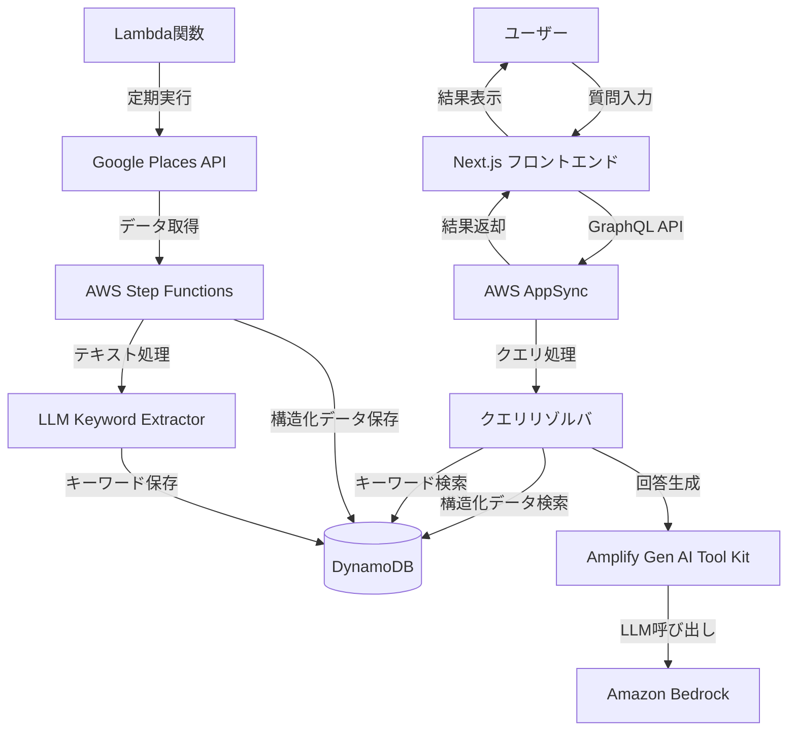

# 設計ドキュメント：居酒屋レビュー検索システム

## 概要

「居酒屋レビュー検索」は、ユーザーが自然言語で希望条件を入力することで、その条件に合った居酒屋を検索できるウェブサービスです。このシステムは、Google Places APIから取得した口コミデータと構造化データ（営業時間、個室の有無など）を組み合わせて、ユーザーの質問に最適な回答を生成します。

このドキュメントでは、システムのアーキテクチャ、コンポーネント、データモデル、エラー処理、およびテスト戦略について詳細に説明します。

## アーキテクチャ

システムは、AWS Amplifyを活用したサーバーレスアーキテクチャを採用し、以下の主要コンポーネントで構成されます：



### 技術スタック

1. **フロントエンド**
   - Next.js（React）：SSRによるパフォーマンス最適化
   - Tailwind CSS：レスポンシブデザイン
   - AWS Amplify：認証、API連携、ホスティングの簡素化

2. **バックエンド**
   - AWS Amplify：GraphQL APIの自動生成、認証、ストレージの管理
   - AWS AppSync：GraphQLサービス
   - AWS Lambda：サーバーレス関数

3. **データベース**
   - Amazon DynamoDB：NoSQLデータベース（Amplifyと統合）
   - Amazon DynamoDB GSI：キーワードベースの検索インデックス（コスト効率を考慮）

4. **AI/ML**
   - AWS Amplify Gen AI：最新のAmplify AI機能を活用
     - `@aws-amplify/ui-react-gen-ai`：チャットUIコンポーネント
     - `aws-amplify/gen-ai`：LLMとの連携を簡素化
     - Amplify.GenAI.Bedrock：Bedrockモデルとの統合
     - Amplify.GenAI.Embeddings：テキスト埋め込み生成
   - Amazon Bedrock：LLMサービス（Claude, Titan等）
   - RAG（Retrieval-Augmented Generation）：Amplify Gen AIのRAG機能を活用
   - Amplify Gen AI Chat：チャットインターフェースの実装

5. **データ収集**
   - AWS Lambda：定期的なデータ収集ジョブ
   - Google Places API：店舗情報と口コミの取得
   - AWS Step Functions：データ収集ワークフローの管理

6. **インフラストラクチャ**
   - AWS Amplify CLI：インフラストラクチャのプロビジョニングと管理
   - AWS CloudFormation：インフラストラクチャのコード化（IaC）
   - AWS EventBridge：定期的なデータ収集ジョブのスケジューリング

## コンポーネントとインターフェース

### 1. フロントエンドコンポーネント

#### 1.1 検索インターフェース
- Amplify Gen AI Chat コンポーネントを活用したチャットインターフェース
  ```tsx
  import { ChatUI } from '@aws-amplify/ui-react-gen-ai';
  
  function IzakayaSearchChat() {
    return (
      <ChatUI
        chatComponents={{
          // カスタムコンポーネント設定
          MessageInput: CustomMessageInput,
          MessageBubble: CustomMessageBubble
        }}
        onSendMessage={handleSendMessage}
      />
    );
  }
  ```
- 検索履歴表示
- 検索中のローディングインジケータ

#### 1.2 結果表示コンポーネント
- 検索結果リスト（最大20件）
- 各店舗の基本情報カード
- 店舗詳細モーダル/ページ
- 追加絞り込み条件の提案UI
- レスポンシブデザインによるモバイル対応

### 2. バックエンドコンポーネント

#### 2.1 クエリプロセッサ
- 自然言語クエリの解析
- 構造化クエリへの変換
- 検索条件の抽出

#### 2.2 検索エンジン
- 構造化データ検索
- キーワードベース検索
- 結果のランキングと統合

#### 2.3 回答生成エンジン
- RAGベースの回答生成
- 条件緩和提案の生成
- 追加絞り込み条件の提案生成

### 3. データ収集コンポーネント

#### 3.1 Google Places APIクライアント
- 店舗情報の取得
- 口コミデータの取得
- レート制限の管理

#### 3.2 データプロセッサ
- 構造化データの抽出と正規化
- 口コミテキストの前処理
- テキスト埋め込みの生成

### コンポーネント間インターフェース

#### API エンドポイント

1. **検索API**
   ```
   POST /api/search
   {
     "query": "上司といける海鮮がうまい店"
   }
   ```

2. **店舗詳細API**
   ```
   GET /api/izakaya/{izakayaId}
   ```

3. **データ収集ジョブAPI**（管理者用）
   ```
   POST /api/admin/collect-data
   {
     "force": false
   }
   ```

## データモデル

### 1. 店舗（Izakaya）モデル

```typescript
interface Izakaya {
  id: string;                 // 一意のID
  name: string;               // 店舗名
  address: string;            // 住所
  location: {                 // 位置情報
    lat: number;
    lng: number;
  };
  rating: number;             // 評価（5段階）
  userRatingsTotal: number;   // 評価数
  priceLevel: number;         // 価格帯（1-4）
  photos: string[];           // 写真のURL
  website: string;            // ウェブサイト
  phoneNumber: string;        // 電話番号
  businessHours: {            // 営業時間
    [day: string]: {
      open: string;
      close: string;
    }
  };
  features: {                 // 特徴
    hasPrivateRoom: boolean;  // 個室あり
    smoking: boolean;         // 喫煙可
    reservation: boolean;     // 予約可
    // その他の特徴
  };
  lastUpdated: Date;          // 最終更新日時
}
```

### 2. 口コミ（Review）モデル

```typescript
interface Review {
  id: string;                 // 一意のID
  izakayaId: string;          // 店舗ID
  author: string;             // 著者名
  rating: number;             // 評価（5段階）
  text: string;               // 口コミテキスト
  time: Date;                 // 投稿日時
  keywords: string[];         // LLMによって抽出された関連キーワード
}
```

### 3. 検索クエリ（SearchQuery）モデル

```typescript
interface SearchQuery {
  id: string;                 // 一意のID
  rawQuery: string;           // 元のクエリテキスト
  structuredConditions: {     // 構造化された条件
    priceRange?: {
      min?: number;
      max?: number;
    };
    features?: string[];      // 必要な特徴（個室など）
    location?: string;        // 場所の指定
    // その他の構造化条件
  };
  extractedKeywords: string[]; // LLMによって抽出された検索キーワード
  timestamp: Date;            // 検索実行時刻
}
```

### 4. 検索結果（SearchResult）モデル

```typescript
interface SearchResult {
  query: SearchQuery;         // 検索クエリ
  results: {
    izakaya: Izakaya;         // 店舗情報
    relevanceScore: number;   // 関連性スコア
    matchingReviews: {        // マッチした口コミ
      review: Review;
      score: number;
    }[];
    explanation: string;      // マッチ理由の説明
  }[];
  relaxedConditions?: {       // 緩和された条件の提案
    condition: string;
    results: number;
  }[];
  narrowingConditions?: {     // 絞り込み条件の提案
    condition: string;
    expectedResults: number;
  }[];
}
```

## データベーススキーマ

### PostgreSQLスキーマ

```sql
-- 店舗テーブル
CREATE TABLE izakayas (
  id VARCHAR(255) PRIMARY KEY,
  name VARCHAR(255) NOT NULL,
  address TEXT NOT NULL,
  lat DOUBLE PRECISION,
  lng DOUBLE PRECISION,
  rating DECIMAL(2,1),
  user_ratings_total INTEGER,
  price_level SMALLINT,
  website TEXT,
  phone_number VARCHAR(20),
  business_hours JSONB,
  features JSONB,
  last_updated TIMESTAMP WITH TIME ZONE
);

-- 口コミテーブル
CREATE TABLE reviews (
  id VARCHAR(255) PRIMARY KEY,
  izakaya_id VARCHAR(255) REFERENCES izakayas(id),
  author VARCHAR(255),
  rating SMALLINT,
  text TEXT,
  time TIMESTAMP WITH TIME ZONE,
  keywords TEXT[]  -- キーワード配列
);

-- 検索クエリログテーブル
CREATE TABLE search_queries (
  id UUID PRIMARY KEY DEFAULT gen_random_uuid(),
  raw_query TEXT NOT NULL,
  structured_conditions JSONB,
  extracted_keywords TEXT[],
  timestamp TIMESTAMP WITH TIME ZONE DEFAULT NOW()
);

-- インデックス
CREATE INDEX idx_izakayas_features ON izakayas USING GIN (features);
CREATE INDEX idx_izakayas_location ON izakayas USING GIST (point(lat, lng));
CREATE INDEX idx_reviews_izakaya_id ON reviews(izakaya_id);
CREATE INDEX idx_reviews_keywords ON reviews USING GIN (keywords);
```

## エラー処理

### 1. API エラー処理

- 400 Bad Request: 不正なリクエストパラメータ
- 404 Not Found: リソースが見つからない
- 429 Too Many Requests: レート制限超過
- 500 Internal Server Error: サーバー内部エラー

各エラーは以下の形式でレスポンスされます：

```json
{
  "error": {
    "code": "ERROR_CODE",
    "message": "ユーザーフレンドリーなエラーメッセージ",
    "details": "詳細なエラー情報（開発環境のみ）"
  }
}
```

### 2. データ収集エラー処理

- Google Places API接続エラー: 再試行ロジックを実装
- レート制限エラー: バックオフ戦略を実装
- データ処理エラー: 部分的な成功を許容し、エラーログを記録

### 3. ユーザーフィードバック

- 検索結果がない場合: 条件緩和の提案を表示
- 検索結果が多すぎる場合: 絞り込み条件の提案を表示
- システムエラーの場合: ユーザーフレンドリーなエラーメッセージを表示

## テスト戦略

### 1. ユニットテスト

- クエリプロセッサのテスト: 様々な自然言語クエリに対する構造化変換のテスト
- データプロセッサのテスト: 異なる形式のデータに対する処理のテスト
- 回答生成エンジンのテスト: 様々な検索結果に対する回答生成のテスト

### 2. 統合テスト

- API エンドポイントのテスト: リクエスト/レスポンスの検証
- データベース操作のテスト: CRUD操作の検証
- 外部APIとの連携テスト: モックを使用したGoogle Places APIとの連携テスト

### 3. エンドツーエンドテスト

- ユーザーフローのテスト: 検索から結果表示までの一連の流れのテスト
- レスポンシブデザインのテスト: 様々なデバイスサイズでのUIテスト
- パフォーマンステスト: 応答時間とスケーラビリティのテスト

### 4. 負荷テスト

- 同時アクセスのテスト: 複数ユーザーによる同時アクセス時の挙動テスト
- データベース負荷テスト: 大量のデータに対する検索パフォーマンステスト

## コスト最適化戦略

### 1. インフラストラクチャ

- サーバーレスアーキテクチャの採用: 使用量に応じた課金
- 自動スケーリングの設定: 需要に応じたリソース割り当て
- キャッシュの活用: 頻繁に使用されるデータのキャッシュ

### 2. API使用量

- Google Places APIの呼び出し最適化: 必要最小限の呼び出しに制限
- バッチ処理の実装: 複数のリクエストをバッチ処理
- データ更新頻度の最適化: 更新頻度を店舗の人気度に応じて調整

### 3. AI/ML コスト

- ローカルベクトルデータベース（pgvector）の使用: クラウドベクトルDBよりコスト効率が高い
- 埋め込みキャッシュの実装: 同じテキストに対する埋め込み計算の重複を避ける
- LLM呼び出しの最適化: プロンプトの最適化とトークン数の削減

## セキュリティ考慮事項

### 1. データ保護

- 個人識別情報（PII）の匿名化: 口コミ著者の情報を保護
- データ暗号化: 保存データと転送データの暗号化
- アクセス制御: 適切な権限管理

### 2. API セキュリティ

- レート制限: DDoS攻撃の防止
- 入力検証: インジェクション攻撃の防止
- APIキー管理: 安全なキー管理と定期的なローテーション

### 3. フロントエンドセキュリティ

- CSP (Content Security Policy): XSS攻撃の防止
- CSRF保護: クロスサイトリクエストフォージェリの防止
- セキュアなHTTPヘッダー: 適切なセキュリティヘッダーの設定